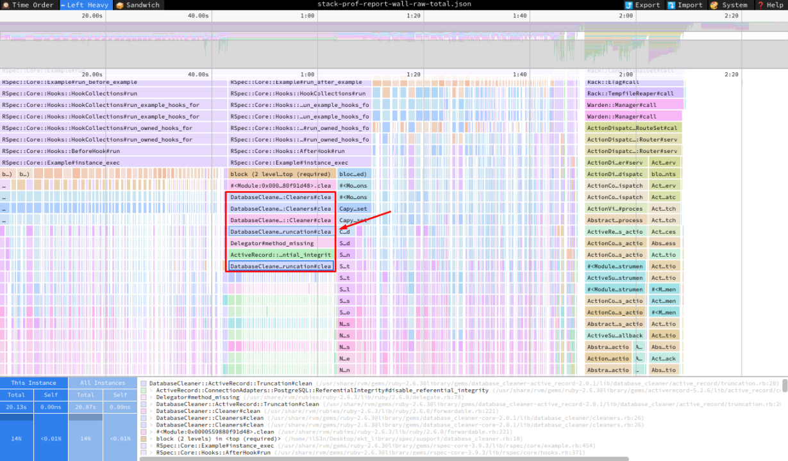
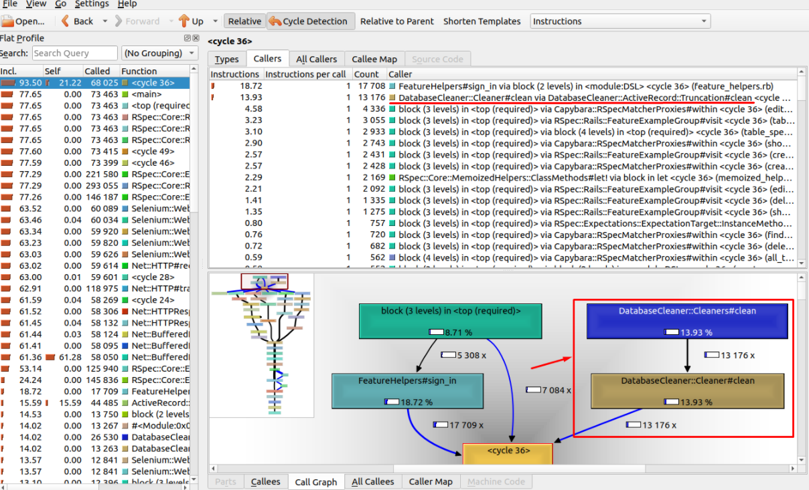
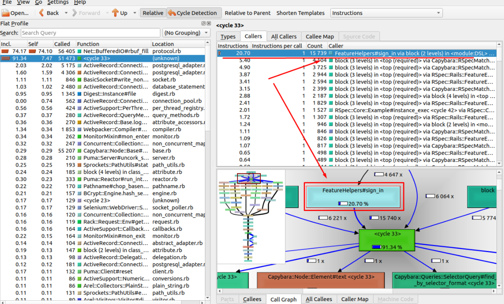
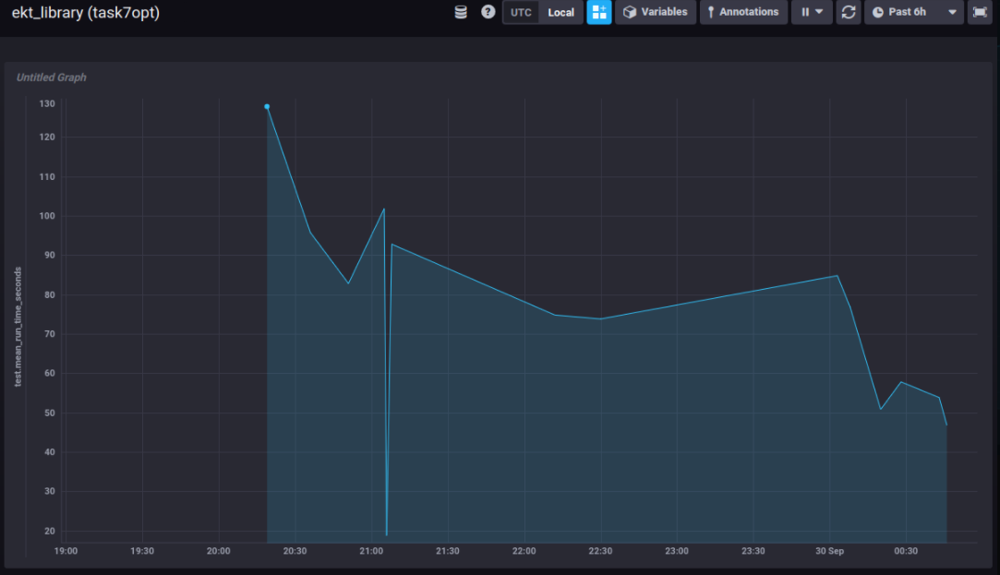

# Задание 7 - Оптимизация DX
[ССЫЛКА НА PR С ИЗМЕНЕНИЯМИ В КОДОВОЙ БАЗЕ](https://github.com/iL53n/ekt_library/pull/48)

## Начальные значения
Первый прогон тестов
```bash
Finished in 2 minutes 8.4 seconds (files took 1.84 seconds to load)
177 examples, 0 failures, 5 pending
Coverage report generated for RSpec to /home/il53n/Desktop/ekt_library/coverage. 1657 / 1677 LOC (98.81%) covered.
```
Для себя установил **БЮДЖЕТ** в **40сек**, т.е. в 3 раза быстрее.

## 1
Установил гем `parallel-tests`, запустил локально в 3 потока, результат порадовал:
```bash
Finished in 1 minute 31.17 seconds (files took 2.23 seconds to load)
177 examples, 0 failures, 5 pendings
Coverage report generated for (1/3), (2/3), (3/3) to /home/il53n/Desktop/ekt_library/coverage. 1491 / 1509 LOC (98.81%) covered.
```
## 2
Отключил логирование. Результат:
```bash
Finished in 1 minute 17.62 seconds (files took 2.86 seconds to load)
177 examples, 0 failures, 5 pendings
Coverage report generated for (1/3), (2/3), (3/3) to /home/il53n/Desktop/ekt_library/coverage. 1493 / 1511 LOC (98.81%) covered.
```
## 3
Отключил `database_cleaner`, часть тестов упало.
Не разбирался, вернусь позже если не смогу другими точками роста выполнить бюджет.

```bash
# 1 прогон
177 examples, 25 failures, 5 pendings
# 2 прогон
177 examples, 137 failures, 5 pendings
```
## 4
Попробовал в работе `rspec --profile`, `ruby_prof`, `stack_prof`, поковырялся в отчете в `speedscope`, в отчете `kcachegrind`... пока больше цель ставил попробовать данные инструменты с тестами.

Везде глаза "мазолил" `database_cleaner`, так что еще не успев забыть возвращаюсь с данному вопросу (отключение гема).


в общем решил вернуться к вопросу удачного прогона тестов без database_cleaner. Отключил, результат:

```bash
Finished in 1 minute 9.8 seconds (files took 2.47 seconds to load)
177 examples, 0 failures, 5 pendings
Coverage report generated for (1/3), (2/3), (3/3), RSpec to /home/il53n/Desktop/ekt_library/coverage. 1651 / 1673 LOC (98.68%) covered.
```
## 5
След инструмент `dissect` показал:

```bash
[TEST PROF INFO] RSpecDissect report

Total time: 01:43.117

Total `let` time: 00:02.716
Total `before(:each)` time: 00:51.494
```

я бы сказал, что с `let` проблем нет, а вот с `before` надо бы поработать

Добавил где возможно `let_it_be`, для `before_all` применения не нашел.

Но вот в отчете обратил внимание на хелпер, который сам когда-то писал для этого проекта (зачем? непонятно) `sign_in`. Отключил его, добавил стандартные методы с `devise`...
Итого результаты порадовали, очень близок к бюджету:

```bash
Finished in 41.89 seconds (files took 2.46 seconds to load)
172 examples, 0 failures
Coverage report generated for (1/3), (2/3), (3/3), RSpec to /home/il53n/Desktop/ekt_library/coverage. 1477 / 1497 LOC (98.66%) covered.
```

```bash
[TEST PROF INFO] RSpecDissect report

Total time: 00:59.819

Total `let` time: 00:00.275
Total `before(:each)` time: 00:09.151
```
## 6
Заюзал `FactoryProf`
```bash
[TEST PROF INFO] Factories usage

 Total: 257
 Total top-level: 215
 Total time: 00:01.749 (out of 00:59.346)
 Total uniq factories: 7

   total   top-level     total time      time per call      top-level time               name

     130         105        1.1031s            0.0085s             0.9451s               user
      64          50        0.3334s            0.0052s             0.2804s               book
      31          31        0.3095s            0.0100s             0.3095s               post
      21          18        0.1069s            0.0051s             0.0820s           category
       6           6        0.0561s            0.0093s             0.0561s            comment
       4           4        0.0481s            0.0120s             0.0481s             rating
       1           1        0.0279s            0.0279s             0.0279s book_with_categories
```
Больших проблем не увидел, но несколько моментов поправил. Итог:

```bash
Total: 248
 Total top-level: 216
 Total time: 00:01.504 (out of 01:02.003)
 Total uniq factories: 7

   total   top-level     total time      time per call      top-level time               name

     125         105        1.0085s            0.0081s             0.8893s               user
      60          51        0.2287s            0.0038s             0.2031s               book
      31          31        0.2073s            0.0067s             0.2073s               post
      21          18        0.1219s            0.0058s             0.0940s           category
       6           6        0.0523s            0.0087s             0.0523s            comment
       4           4        0.0273s            0.0068s             0.0273s             rating
       1           1        0.0312s            0.0312s             0.0312s book_with_categories
```

## Финишный прогон тестов, В БЮДЖЕТ УЛОЖИЛСЯ:

```bash
Finished in 37.27 seconds (files took 2.38 seconds to load)
172 examples, 0 failures
Coverage report generated for (1/3), (2/3), (3/3), RSpec to /home/il53n/Desktop/ekt_library/coverage. 1594 / 1614 LOC (98.76%) covered.
```
## График изменения времени прогона тестов в `Chronograf` по мере оптимизации

