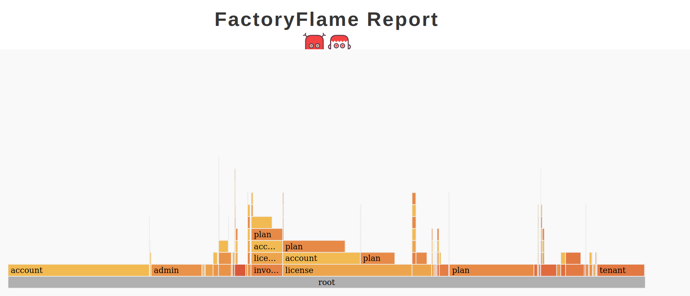

### Первый прогон


### PARALLEL

Второй прогон:



### RSPEC-DISSECT

Выявил пару жирных let'ов
* Первая оптимизациия:
```
Finished in 11.115231994 seconds
Process finished with exit code 0
```
Использовал `let_it_be` вместо `let!` для генерации сложной структуры
```
Finished in 3.488940863 seconds
Process finished with exit code 0
```

* Вторая оптимизациия:
```
Finished in 7.255991587 seconds
```
```
Finished in 1.925112093 seconds
```

Подтянул еще парочку мест не под запись

Остальные спеки показались некритичными по длительности, понятное дело, все подряд не оптимизировал, нет столько времени)

Потыкался в factory-doctor, не стал менять ничего

Финальное время
```
7008 examples, 0 failures, 2 pendings
Took 230 seconds (3:50)
```