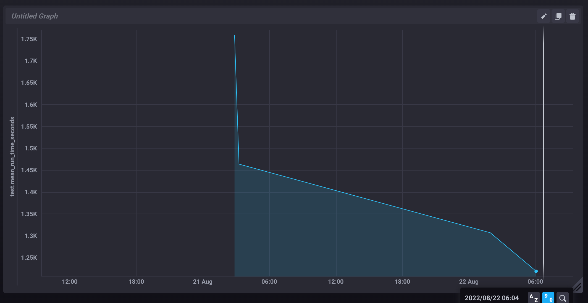

# HW7
## InfluxDB
Репозиторий TICK недоступен, ошибка 404. Походил немного по репозиториям InfluxDB, самое подходящее было sandbox, думаю это то же самое.

Установил, открылся хронограф и документация. Добавил influxer и все необходимые настройки, пробую запустить rake task с отправкой метрики. Данные пришли.

**Первый прогон тестов занял 1760 сек (~29 минут).**

## Профилирование

*Не получилось подключить `stackprof`, при запуске тестов возникает длинная ошибка, начинается всё с `[BUG] Segmentation fault at 0x0000000000000008` и далее огромный лог с бэктрейсами из Ruby, C и т.д. Так и не получилось исправить, поэтому пользуюсь пока только `ruby-prof`*

## Оптимизация №1

Отключил логирование `config.logger = Logger.new(nil)`, тесты стали проходить за **1455 сек**.

## Оптимизация №2

Выпилил `database_cleaner`, включил `config.use_transactional_fixtures = true`. Тесты прошли за **1308 сек**.

## Оптимизация №3

Далее я воспользовался профилировщиком `rspec --profile`, увидел топ-10 самых медленных экзамплов и групп.

Сделал профилирование самой медленной экзампл группы, первая точка роста - `Ethon/Curl::easy_perform^`. По callers понял, что это запросы `elasticsearch`. 

Также по отчету `rspec dissect` понял, что `before` занимает 44 секунды из общих 58.

Решил попробовать воспользоваться хелперами `before_all` и `let_it_be`.

Возникли небольшие ошибки, пришлось переписать в некоторых экзамплах `let` на обновление записи внутри `before`, но зато теперь группа тестов проходит **в 3 раза быстрее, 19 сек!**

## Оптимизация №4

Далее прошелся по этой же экзамп группе с `FPROF`. `Total: 65` и я решил, что некоторые записи тут не нужны и можно как-нибудь исключить их создание.

С помощью transient я передал в factory уже созданные до этого связи и тем самым внутри factory получилось избежать создания лишних записей, при этом не сломались тесты по всему проекту. **Общее количество factories стало 56, а тесты прошли за 18 сек**.

Также в before хуке выполнялось 3 `create_list` по 5 записей, что мне показалось излишним и вполне достаточно создавать по 3 записи. **Теперь всего создаётся 46 factories, а группа тестов проходит за 15 сек**.

Также нашел похожую группу тестов и сделал для них общий `shared_context`. **В ней количество factories изменилось `80 -> 21`, а время выполнения `10 сек -> 4 сек`**.

## Итог

**Полный набор тестов прошёл за 1220 сек.**

Я ускорил прохождение тестов на 31%, настроил отправку данных в InfluxDB и создал график, потестировал несколько профилировщиков и полезных инструментов для работы с тестами.

Получилось оптимизировать пока не так много, как хотелось бы, так как test suite большой, но хорошо прошелся по самой медленной example group и есть понимание что оптимизировать в моём проекте и как. Разработал уже неплохой фидбэк луп, с помощью которого в будущем буду двигаться по всем остальным медленным тестам.

