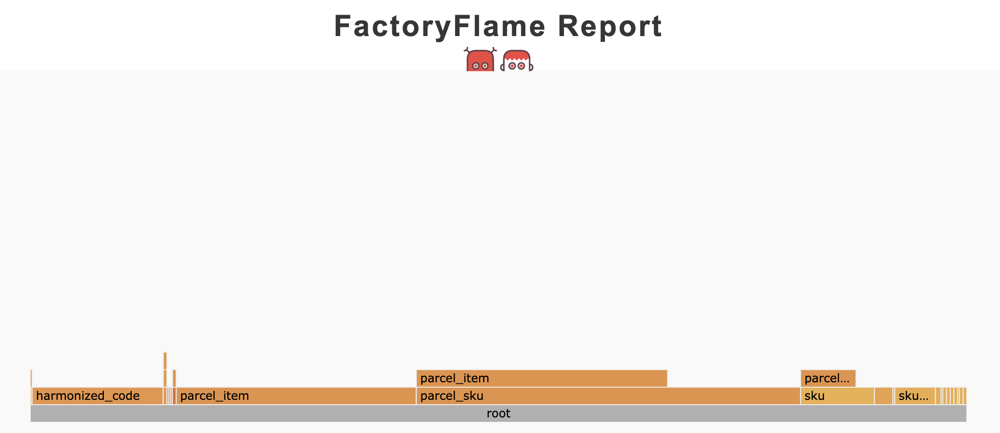
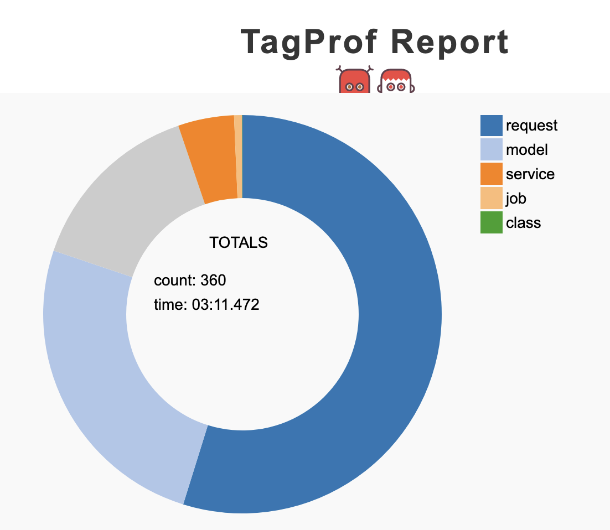
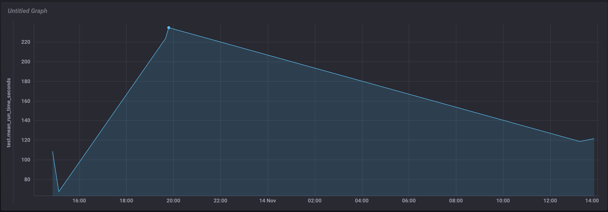

# Case-study

1. Прогнал все тесты в режиме `--profile` и получил список самых медленных тестов и групп
    ```
    Top 10 slowest examples (19.31 seconds, 19.6% of total time):
      Api::V2::SkusHistories /skus_import_batch PUT adds rows to SkusImportBatch
        3.69 seconds ./spec/api/v2/skus_histories_spec.rb:207
    ...

    Top 10 slowest example groups:
      Api::V2::SkusGroup
        0.83148 seconds average (4.99 seconds / 6 examples) ./spec/api/v2/skus_group_spec.rb
    ...

    Finished in 1 minute 38.63 seconds (files took 9.67 seconds to load)
    360 examples, 0 failures, 1 pending
    ```

2. Настроил связку `InfluxDB` и `Chronograf` собрал первые данные

3. Пробовал запускать в паралельно, но больше половины тестов свалилось, много ошибок связаных с `Eelasticsearch`, решил отложить на потом

4. Добавил гем `test-prof`
    - Поигрался со `stackprof`. Запускал в `https://www.speedscope.app` и `qcachegrind`, не нашол ничего конкретного для оптимизации
    - Прогнал тесты в режиме `Rspec-Dissect` запустив `RD_PROF=1 rspec`
        ```
        Total time: 02:07.425

        Total `let` time: 00:20.822
        Total `before(:each)` time: 00:54.214

        Top 5 slowest suites (by `let` time):

        UpdateSkuService (./spec/services/update_sku_service_spec.rb:3) – 00:06.811 of 00:07.615 (44)
        ...
        ...
        ```
        * Запустил `RD_PROF=1 rspec spec/services/update_sku_service_spec.rb:3`
            ```
            Total time: 00:07.872

            Total `let` time: 00:06.945
            Total `before(:each)` time: 00:05.030
            ```
        * Заменил `let!` на `let_it_be` запустил еще раз
            ```
            Total time: 00:04.138

            Total `let` time: 00:03.245
            Total `before(:each)` time: 00:01.325
            ```
    - Прогнал тесты с помощью `FactoryProf`
        ```
        [TEST PROF INFO] Time spent in factories: 00:26.795 (14.02% of total time)
        ```
        ```
        [TEST PROF INFO] Factories usage

        Total: 680
        Total top-level: 507
        Total time: 00:16.351 (out of 01:52.903)
        Total uniq factories: 23

        total   top-level     total time      time per call      top-level time               name

        296         130        2.7250s            0.0092s             1.2657s        parcel_item
        208         208       11.5975s            0.0558s            11.5975s         parcel_sku
        73          71        0.6848s            0.0094s             0.6688s    harmonized_code
        ```
        
    - Прогнал тесты с помощью `FactoryDoctor`
        ```
        [TEST PROF INFO] FactoryDoctor report

        Total (potentially) bad examples: 9
        Total wasted time: 00:01.023
        ```
    - Прогнал тесты с помощью `TagProf`
        

## Заключение

После ознакомления с `TestProf` и сбора DX метрик я понял что в даном проекти все хорошо.



