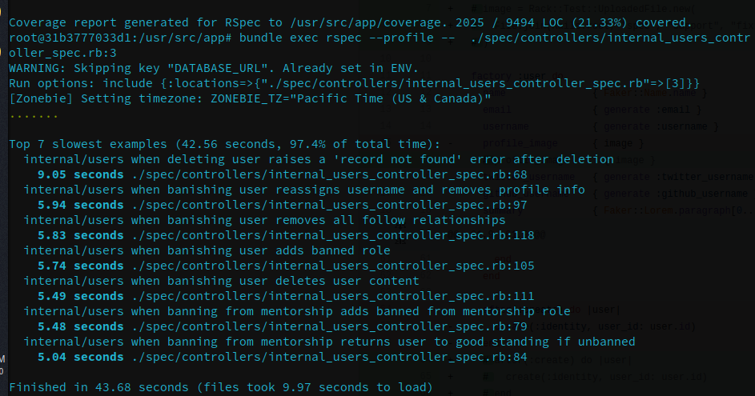
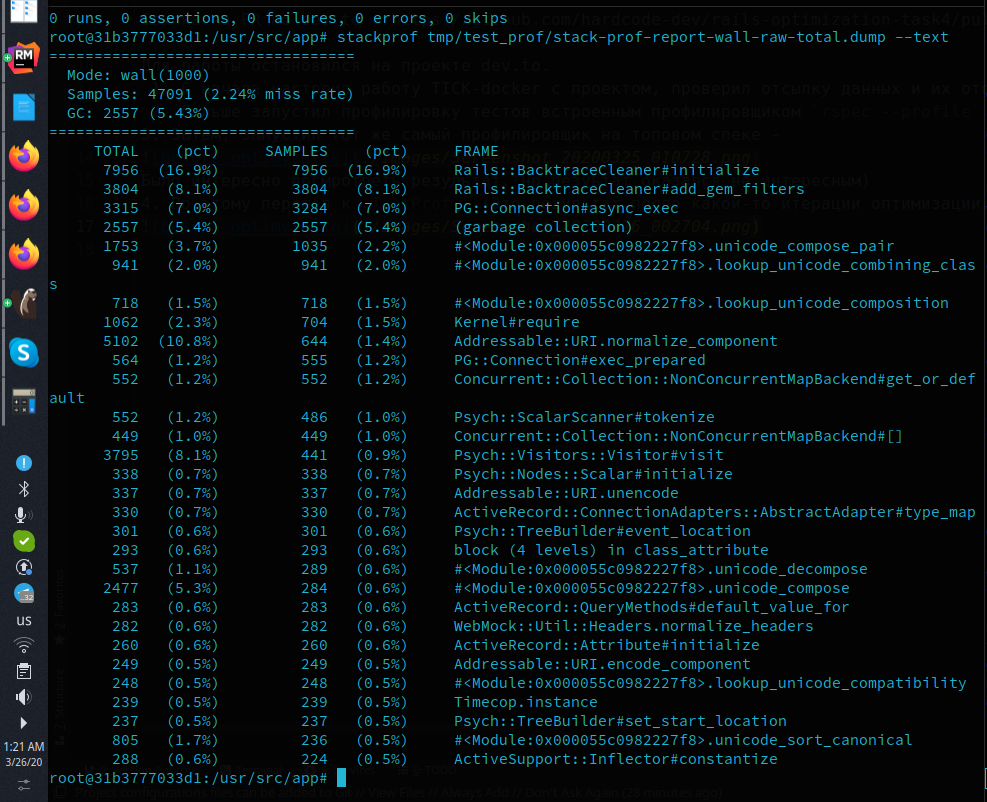
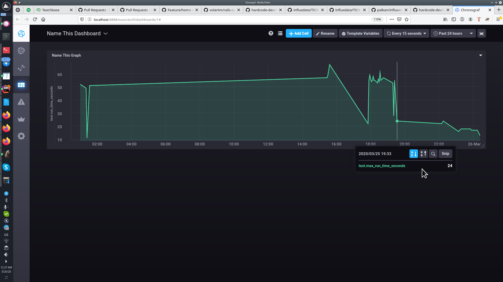

###Task 7
## Чек-лист для сдачи задания
- [x] PR в этот репозиторий с `case-study` о проделанной оптимизации и достигнутых результатах в описании
- [x] Если оптимизируете `dev.to`, то сделать `PR` с оптимизацией в https://github.com/hardcode-dev/rails-optimization-2-task4 и добавить в этот PR ссылку на него
- [x] Добавить скриншот с графиком изменения времени прогона `test-suite` в `Chronograf` по мере оптимизации

Ссылка на PR по dev.to - https://github.com/hardcode-dev/rails-optimization-task4/pull/33

Для работы остановился на проекте dev.to. Интересно будет после окончания курса заоптимизировать тесты по проекту на работе, уверен на 100%, что есть куда оптимизировать, но что бы было проще разбираться с новыми инструментами и подходами, остановился на `dev.to`
 1. С начала настроил работу TICK-docker с проектом, проверил отсылку данных и их отображение на графике.
 2. Дальше запустил профилировку тестов встроенным профилировщиком `rspec --profile` по всем тестам, не дождавшись окончания, прервал выполнение и получил вывод о наиболее длительных спеках.
3. Затем, запустил тот же самый профилировщик на топовом спеке -

Было интересно посмротреть результат, но резуьтат оказался не интересным)
4. По этому перешел к `TestProf`. (Это результат после какой-то итерации оптимизации, не записал, после какой, к сожалению)

4.1 удалось избавиться от databse_cleaner-а \
4.2 частично по грязному ускорил работу BacktraceCleaner \
5. Подключив `let_it_be` и `bootsnap`, и убрав не нужные методы из `spec/factories/users.rb` удалось сократить время загрузки и работы тестов на примере `spec/controllers/internal_users_controller_spec.rb` c 62 секунда до 12.

6. Так же поработал с семплированием спеков.