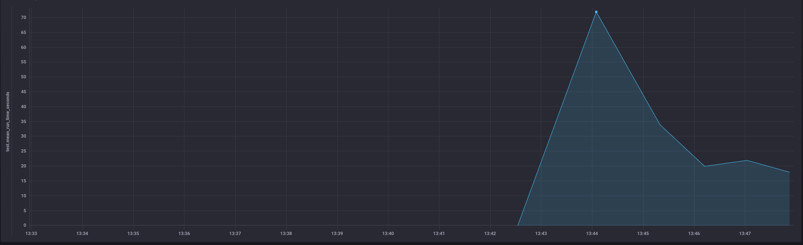

## Сбор DX-метрики

- Настроил сбор и отображение местрик с помощью TICK

Исходные измерения:
```
Количество тестов: 680
Время выполнения тестов: 71 сек.
```

## Оптимизация

### №1
Выполнил `rspec --profile`

```
Top 10 slowest examples (46.05 seconds, 73.9% of total time):
  Lighthouse::Loader.load returns reports
    35.8 seconds ./spec/services/lighthouse/loader_spec.rb:11
  DomainPolicy forbid unlimited create search phrases
    8.36 seconds ./spec/policies/domain_policy_spec.rb:24
  AccountNotificationsService when notifications present #send_notifications changes a account notified date
    0.32117 seconds ./spec/services/account_notifications_service_spec.rb:30
  Google::PageSpeed::BaseService.load returns reports
    0.2995 seconds ./spec/services/google/page_speed/base_service_spec.rb:12
  Google::PageSpeed::Loader.call when limits are exceeded does not create request
    0.29272 seconds ./spec/services/google/page_speed/loader_spec.rb:40
  Google::PageSpeed::Loader.call when limits are exceeded does not reduce the quota
    0.25092 seconds ./spec/services/google/page_speed/loader_spec.rb:45
  Google::PageSpeed::Loader.call when limits are exceeded raises error
    0.22131 seconds ./spec/services/google/page_speed/loader_spec.rb:36
  Ssl::Reporter#create_report creates a report
    0.18945 seconds ./spec/support/shared_examples/reporter_examples.rb:12
  AccountNotificationsService when notifications present #send_notifications returns count of enabled notification
    0.15965 seconds ./spec/services/account_notifications_service_spec.rb:40
  AccountNotificationsService when notifications present #send_notifications returns only enabled notification
    0.15415 seconds ./spec/services/account_notifications_service_spec.rb:44

Top 10 slowest example groups:
  Lighthouse::Loader
    35.8 seconds average (35.8 seconds / 1 example) ./spec/services/lighthouse/loader_spec.rb:5
  DomainPolicy
    2.8 seconds average (8.41 seconds / 3 examples) ./spec/policies/domain_policy_spec.rb:5
  Google::PageSpeed::BaseService
    0.29995 seconds average (0.29995 seconds / 1 example) ./spec/services/google/page_speed/base_service_spec.rb:5
  Ssl::Reporter
    0.19018 seconds average (0.19018 seconds / 1 example) ./spec/services/ssl/reporter_spec.rb:5
  Google::PageSpeed::Loader
    0.15739 seconds average (0.94433 seconds / 6 examples) ./spec/services/google/page_speed/loader_spec.rb:5
  Google::PageSpeed::QuotaChecker
    0.13753 seconds average (0.55011 seconds / 4 examples) ./spec/services/google/page_speed/quota_checker_spec.rb:5
  Lighthouse::Reporter
    0.11583 seconds average (0.34749 seconds / 3 examples) ./spec/services/lighthouse/reporter_spec.rb:5
  AccountNotificationsService
    0.11011 seconds average (0.88092 seconds / 8 examples) ./spec/services/account_notifications_service_spec.rb:5
  Google::PageSpeed::Reporter
    0.10417 seconds average (0.3125 seconds / 3 examples) ./spec/services/google/page_speed/reporter_spec.rb:5
  DataCleaner
    0.10119 seconds average (0.20238 seconds / 2 examples) ./spec/services/data_cleaner_spec.rb:5
```

Есть точка роста `35.8 seconds ./spec/services/lighthouse/loader_spec.rb:11`, внутри класса идет прогон lighthouse, замокаем этот прогон

Внес изменения:
```
Время выполнения тестов: 34 сек.
```

Время выполнения сократилось в 2 раза, точка роста ушла

### №2
Выполнил `rspec --profile`

```
Top 10 slowest examples (10.72 seconds, 40.2% of total time):
  DomainPolicy forbid unlimited create search phrases
    8.64 seconds ./spec/policies/domain_policy_spec.rb:24
  AccountNotificationsService when notifications present #send_notifications changes a account notified date
    0.33898 seconds ./spec/services/account_notifications_service_spec.rb:30
  Google::PageSpeed::Loader.call when limits are exceeded does not reduce the quota
    0.31088 seconds ./spec/services/google/page_speed/loader_spec.rb:45
  Google::PageSpeed::Loader.call when limits are exceeded does not create request
    0.29836 seconds ./spec/services/google/page_speed/loader_spec.rb:40
  Google::PageSpeed::Loader.call when limits are exceeded raises error
    0.29587 seconds ./spec/services/google/page_speed/loader_spec.rb:36
  Google::PageSpeed::BaseService.load returns reports
    0.26205 seconds ./spec/services/google/page_speed/base_service_spec.rb:12
  Favicon::Notifier#check_and_notify when there is a difference checking receiver
    0.19364 seconds ./spec/support/shared_examples/notifier_examples.rb:41
  Lighthouse::Loader.load returns reports
    0.13372 seconds ./spec/services/lighthouse/loader_spec.rb:11
  AccountNotificationsService when notifications present #send_notifications sends a email with notifications
    0.13202 seconds ./spec/services/account_notifications_service_spec.rb:26
  Google::PageSpeed::QuotaChecker.call when limits exceeded when the interval request limit is exceeded returns error
    0.11923 seconds ./spec/services/google/page_speed/quota_checker_spec.rb:34

Top 10 slowest example groups:
  DomainPolicy
    2.89 seconds average (8.68 seconds / 3 examples) ./spec/policies/domain_policy_spec.rb:5
  Google::PageSpeed::BaseService
    0.26252 seconds average (0.26252 seconds / 1 example) ./spec/services/google/page_speed/base_service_spec.rb:5
  Google::PageSpeed::Loader
    0.18792 seconds average (1.13 seconds / 6 examples) ./spec/services/google/page_speed/loader_spec.rb:5
  Lighthouse::Loader
    0.13445 seconds average (0.13445 seconds / 1 example) ./spec/services/lighthouse/loader_spec.rb:5
  Lighthouse::Reporter
    0.11119 seconds average (0.33357 seconds / 3 examples) ./spec/services/lighthouse/reporter_spec.rb:5
  DataCleaner
    0.1041 seconds average (0.2082 seconds / 2 examples) ./spec/services/data_cleaner_spec.rb:5
  Google::PageSpeed::QuotaChecker
    0.1035 seconds average (0.414 seconds / 4 examples) ./spec/services/google/page_speed/quota_checker_spec.rb:5
  AccountNotificationsService
    0.10034 seconds average (0.80273 seconds / 8 examples) ./spec/services/account_notifications_service_spec.rb:5
  Google::PageSpeed::Reporter
    0.09067 seconds average (0.272 seconds / 3 examples) ./spec/services/google/page_speed/reporter_spec.rb:5
  Favicon::Notifier
    0.09044 seconds average (0.54262 seconds / 6 examples) ./spec/services/favicon/notifier_spec.rb:5
```

Есть точка роста `8.64 seconds ./spec/policies/domain_policy_spec.rb:24`, обноружил ошибку, с созданием большого кол-во объектов, хотя для теста это абсолютно не нужно делать

Внес изменения:
```
Время выполнения тестов: 20 сек.
```

Время выполнения сократилось, точка роста ушла

### №3

Профилирование фабрик:
```
[TEST PROF INFO] Factories usage

 Total: 4329
 Total top-level: 1391
 Total time: 00:12.267 
 Total uniq factories: 17

   total   top-level     total time      time per call      top-level time               name

     543         105        4.1367s            0.0076s             0.3333s            project
     527         189        7.4906s            0.0142s             1.9339s             domain
     527           0        1.0937s            0.0021s             0.0000s            country
     510          55        2.2853s            0.0045s             0.3745s               user
     507          89        4.9118s            0.0097s             0.3722s             client
     507           3        3.1166s            0.0061s             0.0235s            account
     396         396        0.6260s            0.0016s             0.6260s page_speed_request
     388         173        6.9221s            0.0178s             2.6414s                url
     173         133        1.6504s            0.0095s             0.7521s       task_setting
     149         146        4.5260s            0.0304s             4.3825s             metric
      52          52        0.1272s            0.0024s             0.1272s       notification
      18          18        0.1314s            0.0073s             0.1314s              group
      10          10        0.0469s            0.0047s             0.0469s      search_phrase
      10          10        0.0185s            0.0018s             0.0185s   page_speed_quota
       8           8        0.3242s            0.0405s             0.3242s    downtime_metric
       3           3        0.1662s            0.0554s             0.1662s  lighthouse_report
       1           1        0.0136s            0.0136s             0.0136s         url_import

```

RSpecDissect:
```
[TEST PROF INFO] RSpecDissect report

Total `let` time: 00:13.215
Total `before(:each)` time: 00:10.194

Top 5 slowest suites (by `let` time):

AccountNotificationsService (./spec/services/account_notifications_service_spec.rb:5) – 00:00.767 of 00:00.787 (8)
 ↳ domain – 8
 ↳ subject – 8
 ↳ notifications – 4
Google::PageSpeed::Loader (./spec/services/google/page_speed/loader_spec.rb:5) – 00:00.628 of 00:00.876 (6)
 ↳ page_speed_quota – 10
 ↳ subject – 5
 ↳ page_speed_request – 3
DomainsController (./spec/controllers/domains_controller_spec.rb:5) – 00:00.473 of 00:00.672 (22)
 ↳ domain – 23
 ↳ params – 22
 ↳ user – 16
Metrics::MetricDecorator (./spec/decorators/metrics/metric_decorator_spec.rb:5) – 00:00.469 of 00:00.490 (12)
 ↳ metric – 7
 ↳ decorate_metric – 6
 ↳ result – 1
Api::V1::Doma...UrlsController (./spec/controllers/api/v1/domains/urls_controller_spec.rb:4) – 00:00.437 of 00:00.710 (18)
 ↳ user – 18
 ↳ domain_params – 7
 ↳ url_params – 7

Top 5 slowest suites (by `before(:each)` time):

DomainsController (./spec/controllers/domains_controller_spec.rb:5) – 00:00.558 of 00:00.672 (22)
ClientsController (./spec/controllers/clients_controller_spec.rb:5) – 00:00.506 of 00:00.638 (28)
ProjectsController (./spec/controllers/projects_controller_spec.rb:5) – 00:00.493 of 00:00.614 (32)
AccountNotificationsService (./spec/services/account_notifications_service_spec.rb:5) – 00:00.447 of 00:00.787 (8)
Google::PageS...::QuotaChecker (./spec/services/google/page_speed/quota_checker_spec.rb:5) – 00:00.360 of 00:00.379 (4)
```

Добавил `parallel_tests`, сделал пару запусков и не получил ускорения прогона тестов, +-2 сек. от времени запуска в 1 поток.

## Итого
- Настроил систему мониторинга DX метрик
- Уменьшил время прогона с 72 сек. до 20сек.
