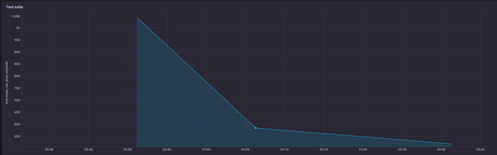
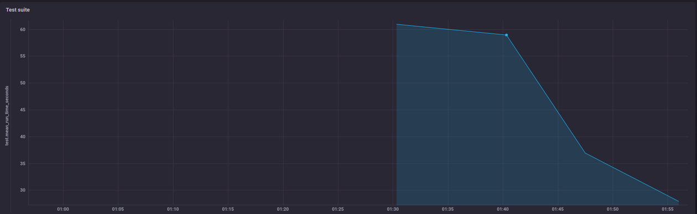

# Задание № 7

[PR с оптимизацией rails-optimization-task4](https://github.com/hardcode-dev/rails-optimization-task4/pull/66)

Решил потренироваться на учебном проекте, прежде чем приступать к оптимизации тестов в рабочем.

### Шаг 1. Общая оптимизация
1. Настройка отправки метрик в `InfluxDB`

Репозиторий TICK-docker, ссылка на который предоставлена в описании задания, отсутствует.

Поэтому воспользовался песочницей https://docs.influxdata.com/platform/install-and-deploy/deploying/sandbox-install/

2. Прогон тестов падал с ошибкой `PG::QueryCanceled: ОШИБКА:  выполнение оператора отменено из-за тайм-аута`.

Изменил `statement_timeout: 0`. После чего тесты стали выполняться.

Часть тестов упала (ERROR -- omniauth: (twitter) Authentication failure! invalid_credentials encountered.).

2.1. Время выполнения всего test-suite до оптимизации (1-я точка на графике рис. 1).
```
Finished in 17 minutes 9 seconds (files took 9.9 seconds to load)
1504 examples, 109 failures, 15 pending
```
2.2. Запустил тесты в параллельном режиме в 3 потока (2-я точка на графике рис. 1).
```
1504 examples, 110 failures, 15 pendings
Took 577 seconds (9:37)
```
2.3. Отключил database_cleaner и логгирование (3-я точка на графике рис. 1).
```
1504 examples, 110 failures, 15 pendings
Took 499 seconds (8:19)
```



### Шаг 2. Профилирование. Оптимизация конкретной спеки
1. Результат работы `rspec --profile`.
```
Top 10 slowest examples (107.54 seconds, 13.1% of total time):
  Reading list without tags when large readinglist shows the large reading list
    25.76 seconds ./spec/features/user_views_a_reading_list_spec.rb:20
  Reading list without tags when large readinglist shows the large readinglist after user clicks the show more button
    24.25 seconds ./spec/features/user_views_a_reading_list_spec.rb:25
  Visiting article comments when root is specified displays related comments
    8.66 seconds ./spec/features/comments/user_views_article_comments_spec.rb:36
  internal/users when deleting user raises a 'record not found' error after deletion
    7.46 seconds ./spec/controllers/internal_users_controller_spec.rb:68
  internal/users when banning from mentorship returns user to good standing if unbanned
    7.2 seconds ./spec/controllers/internal_users_controller_spec.rb:84
  internal/users when banishing user reassigns username and removes profile info
    7.12 seconds ./spec/controllers/internal_users_controller_spec.rb:97
  internal/users when banning from mentorship adds banned from mentorship role
    6.98 seconds ./spec/controllers/internal_users_controller_spec.rb:79
  internal/users when banishing user adds banned role
    6.82 seconds ./spec/controllers/internal_users_controller_spec.rb:105
  internal/users when banishing user deletes user content
    6.74 seconds ./spec/controllers/internal_users_controller_spec.rb:111
  internal/users when banishing user removes all follow relationships
    6.54 seconds ./spec/controllers/internal_users_controller_spec.rb:118

Top 10 slowest example groups:
  Reading list
    13.41 seconds average (53.63 seconds / 4 examples) ./spec/features/user_views_a_reading_list_spec.rb:3
  internal/users
    6.98 seconds average (48.87 seconds / 7 examples) ./spec/controllers/internal_users_controller_spec.rb:3
  Visiting article comments
    6.15 seconds average (36.93 seconds / 6 examples) ./spec/features/comments/user_views_article_comments_spec.rb:3
  Views an article
    3.74 seconds average (7.49 seconds / 2 examples) ./spec/features/articles/user_visits_an_article_spec.rb:3
  Viewing a comment
    3.46 seconds average (6.92 seconds / 2 examples) ./spec/features/comments/user_views_a_comment_spec.rb:3
  User visits a homepage
    3.44 seconds average (13.74 seconds / 4 examples) ./spec/features/homepage/user_visits_homepage_articles_spec.rb:3
  Editing A Comment
    3.28 seconds average (9.85 seconds / 3 examples) ./spec/features/comments/user_edits_a_comment_spec.rb:3
  Creating Comment
    3.13 seconds average (9.4 seconds / 3 examples) ./spec/features/comments/user_fills_out_comment_spec.rb:3
  Organization index
    2.89 seconds average (17.31 seconds / 6 examples) ./spec/features/organization/user_views_an_organization_spec.rb:3
  Organization setting page(/settings/organization)
    2.42 seconds average (4.85 seconds / 2 examples) ./spec/features/organization/user_updates_org_settings_spec.rb:3

Finished in 13 minutes 42 seconds (files took 16.51 seconds to load)
1504 examples, 111 failures, 15 pending
```
2. Результат работы `RD_PROF=1 rspec spec/controllers/internal_users_controller_spec.rb`.

2.1. До оптимизации (1-я точка на графике рис. 2).
```
Total time: 00:51.766

Total `let` time: 00:08.211
Total `before(:each)` time: 00:39.460

Top 5 slowest suites (by `let` time):

internal/users (./spec/controllers/internal_users_controller_spec.rb:3) – 00:08.211 of 00:51.766 (7)
 ↳ user – 43
 ↳ user3 – 29
 ↳ user2 – 22

Top 5 slowest suites (by `before(:each)` time):

internal/users (./spec/controllers/internal_users_controller_spec.rb:3) – 00:39.460 of 00:51.766 (7)
```
2.2. Disable honeycomb (2-я точка на графике рис. 2).
```
Total time: 00:41.296

Total `let` time: 00:06.287
Total `before(:each)` time: 00:31.452

00:31.452 of 00:41.296 (7)
```
2.3. Delete Delayed::Worker from spec, profile_image from user's factory (3-я точка на графике рис. 2).
```
Total time: 00:14.118

Total `let` time: 00:08.372
Total `before(:each)` time: 00:07.775

00:07.775 of 00:14.118 (7)
```
2.4. Using before_all & let_it_be in spec (4-я точка на графике рис. 2).
```
Total time: 00:01.850

Total `let` time: 00:00.000
Total `before(:each)` time: 00:00.158

Top 5 slowest suites (by `let` time):

internal/users (./spec/controllers/internal_users_controller_spec.rb:3) – 00:00.000 of 00:01.850 (7)
 ↳ user – 22
 ↳ super_admin – 7
 ↳ user3 – 1

Top 5 slowest suites (by `before(:each)` time):

internal/users (./spec/controllers/internal_users_controller_spec.rb:3) – 00:00.158 of 00:01.850 (7)
```



2.5. Время выполнения всего test-suite.
```
1504 examples, 110 failures, 15 pendings
Took 295 seconds (4:55)
```

### Результат
* Время выполнения `internal_users_controller_spec` сократилось с 51 сек до 2.
* Время выполнения всего test-suite сократилось с 17:9 до 4:55.
