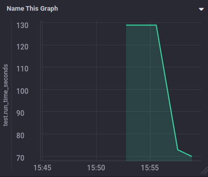
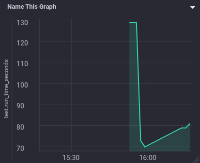
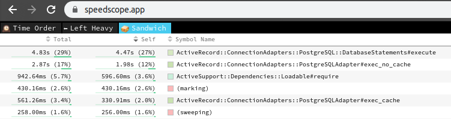

#### Предварительно

* развернул TICK-docker
* добавил в проект `Chronograf`
* использовал рабочий проект

#### Оптимизация

* самое очевидное это использовать параллелизм, добавил. Время исполнения упало практически в 2 раза для 3 потоков



* отключение логирования не дали эффекта (время увеличилось хотя это очень странно)



* подключил test-prof

* первый прогон `rspec --profile` показал следующее

```
0.51585 seconds average (18.57 seconds / 36 examples) ./spec/presenters/api/v1/orders/base_index_presenter_spec.rb:3
0.45214 seconds average (2.71 seconds / 6 examples) ./spec/controllers/api/v1/order_block_controller_spec.rb:3
0.72327 seconds average (2.17 seconds / 3 examples) ./spec/presenters/api/v1/act_index_presenter_spec.rb:3
```

* начнем с главной агонии `RD_PROF=1 rspec ./spec/presenters/api/v1/orders/base_index_presenter_spec.rb`

```
Total time: 00:17.767

Total `let` time: 00:16.736
Total `before(:each)` time: 00:15.028
```

я приложил в источниках самый проблемный файл

* я выделил только 1 переменную `let!(:orders) { create_list(:order, 5) }`.
перенес ее в общеиспользуемые, упало 2 теста. Отрихтовал их. Далее чтобы продолжать нужно погружаться в логику общего призентера. но уже дало ощутимый результат:

```
Total time: 00:10.648

Total `let` time: 00:09.596
Total `before(:each)` time: 00:09.658
```

* добавил `gem 'stackprof'`

`TEST_STACK_PROF=1 TEST_STACK_PROF_FORMAT=json rspec ./spec/presenters/api/v1/orders/base_index_presenter_spec.rb`



результаты ожидаемые, даже сокращения почти в 2 раза, работа с переменными и базой отнимает  практически 50%, потенциал еще есть. Как вариант вынести создание всех переменных вначало. Плюс делат это не отдельными транзакциями, а одной.

#### неудачы

* т.к. в проекте испозуется engine, сходу не удалось завести многопоточные тесты для них (и графики без них). Пример: если запустить `rspec` пробегает по всем тестам, если `rspec --profile` то он не пробегает по тестам engine. Таже проблема происходит если запускать в 3 потока. Потратил какое-то время, пока маны не хватает на решение проблемы.

#### Выводы

* есть понимание, что использование огромного колличества переменных очень сильно замедляет тестироание на проекте
* нравится оптимизировать, азарт.
