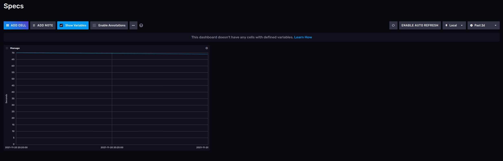
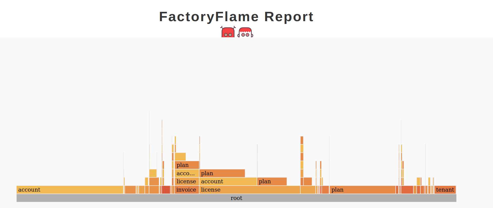
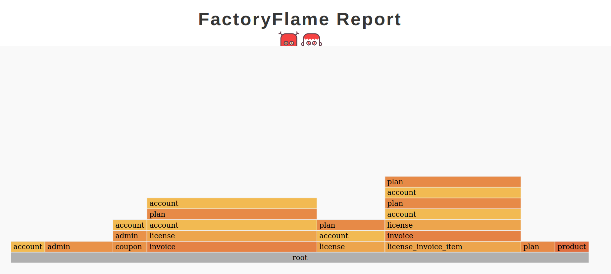

# Case Study

## Подготовка к оптимизации

В целом у нас на проекте принято слежить за производительностью и с тестами уже было всё не так плохо
```
Finished in 1 minute 9.41 seconds (files took 3.87 seconds to load)
1425 examples, 0 failures
```

Для сбора метрик я решил воспользоваться InfluxDB Cloud, благо там есть бесплатный тариф
Настроил бакет, сделал простенькую рейк-таску и проверил что данные доходят до базы.

```ruby
namespace :specs do
  task performance: :environment do
    require 'benchmark'
    require 'influxdb-client'

    client = InfluxDB2::Client.new('https://eu-central-1-1.aws.cloud2.influxdata.com', token,
                                   precision: InfluxDB2::WritePrecision::NANOSECOND)

    time = Benchmark.measure { RSpec::Core::RakeTask.new.run_task(true) }
    data =
      {
        name: 'specs',
        fields: { run_time: time.real.seconds.to_i },
        time: Time.now.utc
      }

    write_api = client.create_write_api
    write_api.write(data: data, bucket: bucket, org: org)
    client.close!

  end
end
```

Добавил дэшборд для вывода графика


## Оптимизация

Самый очевидный способ -- использовать параллел-тестс, но я решил оставить его на потом т.к. он дает не совсем стабильные результаты и эффект других оптимизаций будет замерять сложнее.

Для начала посмотрим что скажет `RD_PROF=1 rspec`

```
Total time: 01:05.249
Total `let` time: 00:31.529
Total `before(:each)` time: 00:26.712
```
Почти всё время это before и let
Однако оно распределено равномерно и по чуть-чуть между экзамплами

### Factory

Посмотрим что там с фабриками `FPROF=1 rspec`
Топ-8 по количеству:
```
TEST PROF INFO] Factories usage

 Total: 6615
 Total top-level: 3855
 Total time: 00:39.028 (out of 01:07.957)
 Total uniq factories: 48

   total   top-level     total time      time per call      top-level time               name

    2016         861       17.7902s            0.0088s             7.6530s            account
    1512         511        4.8693s            0.0032s             1.8555s               plan
    1106         781       16.6163s            0.0150s            10.8128s            license
     383         306        3.8780s            0.0101s             3.1796s              admin
     379         287        0.9506s            0.0025s             0.7057s             tenant
     256         191        6.6933s            0.0261s             4.7481s            invoice
     118         118        1.7697s            0.0150s             1.7697s license_invoice_item
     113         113        1.0771s            0.0095s             1.0771s           reseller
```
Построим флэймграф `FPROF=flamegraph rspec`


`admin` и 'reseller' вызываются в основном в контроллерах, у нас уже есть соответсвующие `shared context`, например реселлер
```ruby
RSpec.shared_context 'reseller_controller' do
  render_views
  let(:reseller) { create :reseller }

  before(:each) do
    sign_in(reseller, scope: :reseller_account)
  end
end
```

### AnyFixture

Перепишем этот контекст так чтобы использовались `any_fixture`

```ruby
RSpec.shared_context 'reseller_controller' do
  render_views
  require 'test_prof/any_fixture/dsl'
  require 'test_prof/ext/active_record_refind'

  using TestProf::AnyFixture::DSL
  using TestProf::Ext::ActiveRecordRefind

  before(:all) do
    fixture(:reseller) { FactoryBot.create(:reseller) }
  end

  let(:reseller) { fixture(:reseller).refind }

  before(:each) do
    sign_in(reseller, scope: :reseller_account)
  end
end
```

И аналогично для `admin`

Посмотрим что получилось

```[TEST PROF INFO] Factories usage

Total: 6027
Total top-level: 3402
Total time: 00:30.800 (out of 01:00.573)
Total uniq factories: 48

total   top-level     total time      time per call      top-level time               name

    1929         826       14.3703s            0.0074s             6.3802s            account
    1512         511        3.6983s            0.0024s             1.2851s               plan
    1106         781       14.6828s            0.0133s             9.7340s            license
     256         191        5.5610s            0.0217s             3.9819s            invoice
     180         171        0.4690s            0.0026s             0.4437s             tenant
     164          87        1.3082s            0.0080s             0.6735s              admin
     118         118        1.4411s            0.0122s             1.4411s license_invoice_item
      96          96        0.9629s            0.0100s             0.9629s prolongation_invoice_item
```

Количество вызовов `admin` значительно сократилось, `reseller` вообще ушёл из топ-8 и имеет всего 30 вызовов

Внешний вид флэймграфа тоже поменялся, но все еще очень много вызовов `account`



На текущий момент сходу больше нет идей где может помочь `any_fixture` поэтому пока двинулся дальше

### Let_it_be

Дабы попробовать `let_it_be` взял небольшой тест флеймграф которого выглядел явно неоптимально, значение тотал -- 67


По мере оптимизаций получился вот такой флеймграф с тоталом 24


И тут я заметил важную вещь -- создание инвойса тянет за собой создание лицензии, хотя в самом проекте мы от этого отказались и такая связь переехала в позиции инвойса

Замеряю сколько сейчас вызовов фабрик:
```
 Total: 5984
```

И убираю создание лицензии из фабрики инвойса

```
 Total: 5234
```

Ушло ровно 750 ненужных вызовов!

Возращаясь к флеймграфу теста выше -- его удалось превратить в идеальный, снизив количество вызовов фабрик с 67 до 10


### FactoryDefault
 
Я обратил внимание что чаще всего вызовы фабрик происходят для `account`и `plan` и в качестве быстрого решения объявил для них фабрики по умолчанию в имеющихся shared context
Таким образом получилось снизить количество вызова фабрик до `4487`

### FactoryAllStub

Прогон `FDOC=1 FDOC_STAMP=factory:stub rspec ./spec/models` позволили выявить лишние создания объектов и сократить количество вызовов до `4296`

## Дальнейшие улучшения

Перенес самые популярные фикстуры и дефолтные фабрики в spec_helper

```ruby
  Rspec.configure do

      config.before(:suite) do
        fixture(:account) { FactoryBot.create(:account) }
        fixture(:plan) { FactoryBot.create(:plan) }
      end
    
      config.before do
        FactoryBot.set_factory_default(:account, fixture(:account))
        FactoryBot.set_factory_default(:plan, fixture(:plan), preserve_traits: true)
      end

  end
```

Решил проверить а сколько времени сэкномили фикстуры, видно что почти все сэконоленное время приходтся на аккаунт, оно и не удивительно

```
[TEST PROF INFO] AnyFixture usage stats:
          key    build time  hit count    saved time
      account     00:00.100       1555     02:35.909
         plan     00:00.026       1439     00:38.316
        admin     00:00.009        241     00:02.247
     reseller     00:00.013         90     00:01.234
  super_admin     00:00.008         88     00:00.758
```

В качестве промежуточного итога -- на данный момент 3126 вызовов фабрик против 6615 в начале


Отчёт RSpecDissect
```
[TEST PROF INFO] RSpecDissect report

Total time: 00:38.348

Total `let` time: 00:13.494
Total `before(:each)` time: 00:09.908
```

Уже стало на 40% быстрее чем было до начала оптимизации!

Я поискал медленные тесты с промощью `rspec --profile` но ничего сильно выдающегося не обнаружил, применение общих профилировщиков тоже не показало явных точек роста.

Убрал DatabaseCleaner который у нас был со времён четвертых рельс, разница получилась небольшая, полторы-две секунды.

Подключил parallel_specs, в резульате поулчился следующий результат:

`Took 19 seconds`

Итого 19 секунд вместо изначальных 69, прирост скорости в 3.5 раза.

График производительности:


Дополнительно настрою репорт времени прогона тестов из CI в InfluxDB Cloud для защиты от регрессий.
