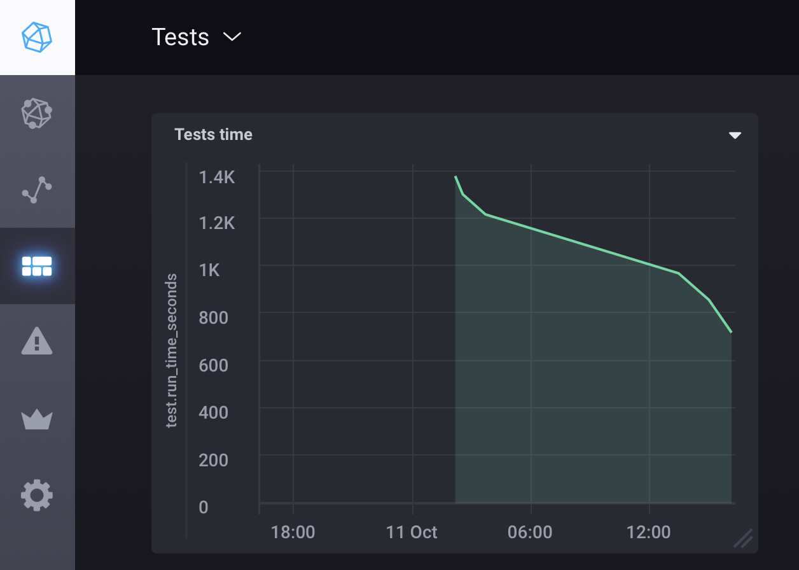

#Case-study оптимизации проекта

##Описание проекта

Рабочий проект связан со сферой логистики и грузоперевозок - водители, рейсы, заказы итд

На проекте тесты стали очень медленными. Прогон тест-сьюта из 2500 тестов на dev машине начал занимать 40 минут. Для ускорения процесса в CI тесты запускаются в две джобы - spec/features и все остальные, это позволяет увидеть результаты через 20-25 минут. На собственных машинах разработчики избегают запуска полного тест-сьюта любыми способами.

##Построение feedback-loop

Исходное время прогона полного тест-сьюта не позволяет использовать его в качестве метрики. Я буду измерять время прогона отдельных файлов или небольших групп файлов, изредка запуская прогон всего сьюта для сбора статистики. 

Используя rspec —profile можно выделить несколько тестов, лидирующих по времени выполнения. В моем случае эти тесты связаны с созданием реестров выполненных грузоперевозок. 

Отдельной проблемой оказалась неработоспособность тест-сьюта на dev машине - выяснилось, что тестовое окружение подхватывает часть переменных окружения из .env, необходимых для работы в development и это ломает тесты, в некоторых тестах требуется реальный redis, часть features тестов мерцает и тд.

Объективно, ситуация с тестами выглядит не очень хорошо - написание новых тестов и их прогон вызывает трудности, как либо модифицировать CI страшно из-за мерцающих тестов, отлаживать тесты очень трудно и медленно так как сами тесты выполняются медленно и долго. 

Попробуем что-то предпринять для улучшения текущей ситуации.

##Local-ci

Для запуска тест-сьюта на своей машине я приблизил свое окружение к окружению ci, чтобы получить полностью рабочий тест-сьют. 
Для этого потребовалось завести .env.development.local, включить редис и добавить некоторые другие настройки, специфичные для test окружения.

Здесь возникла проблема с мерцающими features тестами, которая на ci преодолевается повторной попыткой запуска упавших тестов. Пока решил не пытаться это исправить, вынести spec/features тесты за скуп оптимизации и сфокусироваться на unit - тестах.

Таким образом, определим глобальную цель - 
оптимизировать время выполнения сьюта

bundle exec rspec --exclude-pattern «**/{features,requests}/**/*_spec.rb"

Сьют содержит 2284 теста, время выполнения - 22 минуты

##Замена spring на bootsnap

Для начала я решил попробовать заменить spring на bootsnap, и это дало очень хорошие результаты. Время запуска rails s:

Bootsnap - 4 сек
Cold spring - 15 сек
Hot spring - 10 сек

В нашем случае проект с подключенным бутснапом стартует в два раза быстрее, чем на прогретом спринге. Дополнительно мы получаем значительное улучшение dx в rubymine - поштучный запуск тестов стартует быстрее, полностью уходят странные проблемы с некоторыми версиями дебаггера, встроенного в рубимайн (раньше обновление рубимайна и его встроенного дебаггера было некоторой лотереей).
Отдельные файлы тестов так же запускаются быстрее, что важно для сборки быстрого feedback-loop.

##Parallel-tests

Решил пока не включать parallel tests, так как в ci тесты уже фактически разбиваются на две группы, а добавление ядер к воркерам сопряжено с организационными трудностями.

##Отключение логов в тестах

Отключение логов ускорило прогон тест-сьюта на ~7%

##Фабрики и подготовка тестовых данных

В отчете Stack-prof - qcachegrind видно, что более 85% времени выполняется let! Отчет Rspec-Dissect сообщает: 

Total time: 02:18.901

Total `let` time: 02:18.387
Total `before(:each)` time: 02:18.853

Почти все время выполнения тестов уходит на let и before. 

##let_it_be

Переход на использование let_it_be дал очень хорошие результаты - самый медленный в сьюте спек удалось ускорить с 2 минут 20 секунд до 30 секунд (в 5 раз!). Используя отчет Top 10 slowest example groups из rspec —profile я добавил let_it_be в самые медленные спеки. Становится понятно, что фабрики создания пользователя-заказчика и пользователя-перевозчика работают очень долго. Это типовые места в спеках, их много, их легко найти и переопределять через let_it_be.
Возможно, следует оптимизировать сами фабрики тоже.

##Factory Flamegraph

Factory Flamegraph позволил обнаружить несколько каскадов фабрик, самый большой каскад был связан с фабрикой пользовательских документов. 

##FactoryDoctor

Отчет FactoryDoctor не показал возможности значительной оптимизации.

##RubyProf

В отчете TEST_RUBY_PROF=call_stack обнаружилось, что значительное время расходуется на 
метод notification_create, который конфигурирует уведомления для всех вновь созданных пользователей. Так как в подавляющем количестве тестов в них нет необходимости, их сознание можно отключить. 

##Итого

После всех проделанных оптимизаций удалось сократить время прогона тест-сьюта в два раза с 1400 до примерно 750 секунд. 

