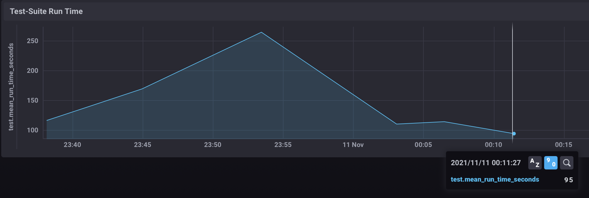

HW7 Case Study by Savchenko

# Case Study by Savchenko

## Актуальная проблема
В нашем проекте возникла серьёзная проблема.

Время прогона тестов на машинах разработчиков составляло более 5 минут (на моей чуть меньше (285 секунд), наверное потому что она помощнеее). Хотелось бы улоди

Я решил исправить эту проблему, оптимизировав test-suite.

## Формирование метрики
Для того, чтобы понимать, дают ли мои изменения положительный эффект я придумал использовать такую метрику: *время прогона тестов на локальной машине*

## Feedback-Loop
Для того, чтобы иметь возможность быстро проверять гипотезы я выстроил эффективный `feedback-loop`, который позволил мне получать обратную связь по эффективности сделанных изменений

Вот как я построил `feedback_loop`:
- с помощью гема `test-prof` формирую отчет который может мне показать точки роста
- вношу правки
- формирую отчет снова и проверяю время прогона всего test-siute в сhronograf

## Вникаем в детали системы, чтобы найти главные точки роста
Для того, чтобы найти "точки роста" для оптимизации я воспользовался
- `rspec --proflie`
- `test-prof` (`rspec-dissect`)
- TICK для отправки метрики и построения графиков

Вот какие проблемы удалось найти и решить

### Находка №1
- Для начала я решил добавить гем parallel_tests в три потока
- Время прогона тестов упало примерно в 2,5 раза с 260 до 111 секунд

### Находка № 2
- Исключил из Gemfile гем `database_cleaner`
- Время прогона тестов незначительно выросло на 4 сек. Больше похоже на погрешность

### Находка № 3
- Отчеты `rspec --profile` показал что самая медленная группа тестов находится в контроллере `cards_controller`, `rspec-dissect` показал проблема в коде который проверяет подписано ли лицензионное соглашение и это делается в каждом котроллере
- Убрал проверку из всех контроллеров и написал абстрактный контроллер где протестировал эту проверку
- Время прогона тесто в составило 95 секунд (в три раза меньше чем изначально)

Прогнал еще раз тесты спустя сутки перед отправкой задания. Время составило 98 секунд 

